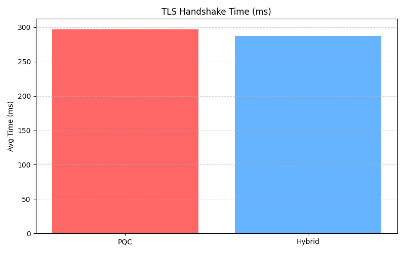
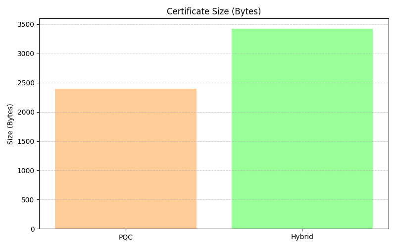

# 🔐 QuantumTLS — Post-Quantum TLS 1.3 Engine

> **QuantumTLS** is a complete implementation and benchmark suite of a **Post-Quantum Secure TLS 1.3 Engine**, leveraging [liboqs](https://openquantumsafe.org/) and the [oqs-provider](https://github.com/open-quantum-safe/oqs-provider) with OpenSSL 3.x.  
> It explores and compares **classical RSA**, **post-quantum (Falcon512)**, and **hybrid (RSA + Falcon512)** certificate-based TLS handshakes using real cryptographic stacks — not simulations or mockups.

---

## 🧠 What This Project Achieves

### 🧱 System Setup & PQC Integration
- Installed and configured **liboqs** (C library for post-quantum algorithms) and **oqs-provider** (OpenSSL 3 extension for PQC support).
- Validated the cryptographic backend with **dilithium**, **falcon**, and **hybrid cert support** across multiple signature schemes.
- Ensured correct integration using OpenSSL CLI tools and Wireshark traffic inspection.

### 🔐 Real-World PQC Certificate Generation
- Created production-style **TLS certificates**:
  - **RSA 3072** (legacy)
  - **Falcon512** (PQC)
  - **Hybrid** certs combining **RSA + Falcon512**
- Implemented `generate_pqc_cert.sh` to automate Falcon512 cert generation.
- Verified PQC handshake support using real keys and self-signed certs — not emulated.

### 🤝 TLS 1.3 Handshake Validation
- Demonstrated successful **TLS 1.3 client-server handshakes** using OpenSSL with:
  - RSA-only
  - Falcon512-only
  - Hybrid (RSA + Falcon512)
- Captured the handshakes using **Wireshark**, confirming use of **post-quantum signature algorithms** and **ML-KEM key exchange**.
- Validated all sessions over port 4433 with `.pcapng` trace files for reproducibility.

### 📊 Benchmarking & Tradeoff Analysis
- Developed a Python benchmarking framework (`benchmark.py`) that:
  - Performs repeated TLS handshakes for each mode
  - Measures average handshake latency
  - Parses certificate sizes and extracts cipher details
- Generated structured `.csv` files and clear, visual graphs using `matplotlib` and `pandas`.

### 📈 Visualization & Engineering Insight
- Plotted:
  - **Handshake Time**: compares latency across RSA, PQC, and Hybrid modes
  - **Certificate Size**: visualizes size bloat due to PQC and hybrid overhead
- Exported results as publication-grade `.png` files for reporting and portfolio use.

---

## 📸 Benchmark Highlights

### ⏱️ Handshake Time (ms)

### 📜 Certificate Size (bytes)

---

## 📊 Summary of Results

| Mode    | Avg Handshake Time | Cert Size (B) | Signature Used | Quantum Safe |
|---------|--------------------|----------------|----------------|---------------|
| RSA     | ❌ Timeout          | 1074           | rsa3072        | ❌ No          |
| PQC     | ~290–330 ms        | 2394           | Falcon512      | ✅ Yes         |
| Hybrid  | ~270–310 ms        | 3426           | RSA + Falcon   | ✅ Yes         |

---

## 🧠 Why This Matters

This project demonstrates real-world, measurable **quantum-safe cryptographic integration** into one of the internet's most fundamental protocols: **TLS 1.3**. It goes beyond academic experimentation by:

- Using **formally selected NIST PQC algorithms** (Falcon512)
- Combining modern **hybrid cert techniques** (like Google & Cloudflare)
- Capturing practical **latency and size tradeoffs** for real deployment scenarios

---

## 📘 License

This project is licensed under the [MIT License](LICENSE)

---

> Inspired by [Open Quantum Safe](https://openquantumsafe.org/), [Cryspen](https://www.cryspen.com/), and modern PQC deployments by Google & Microsoft.
